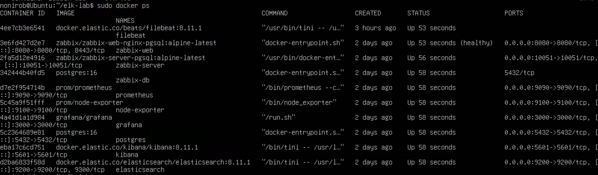
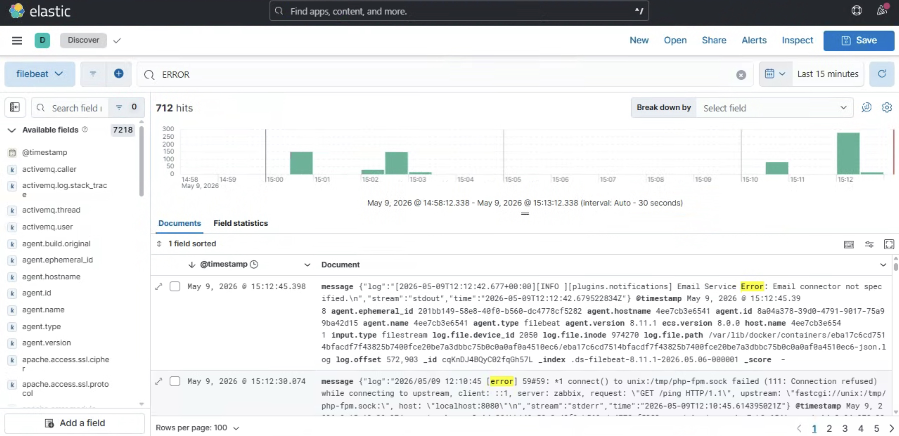
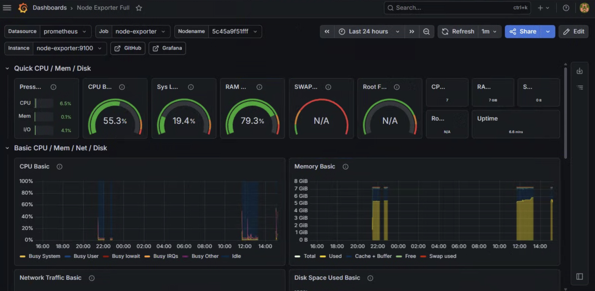
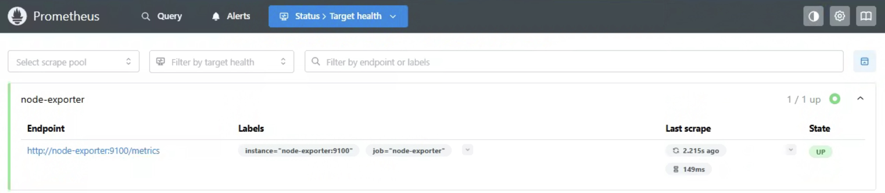
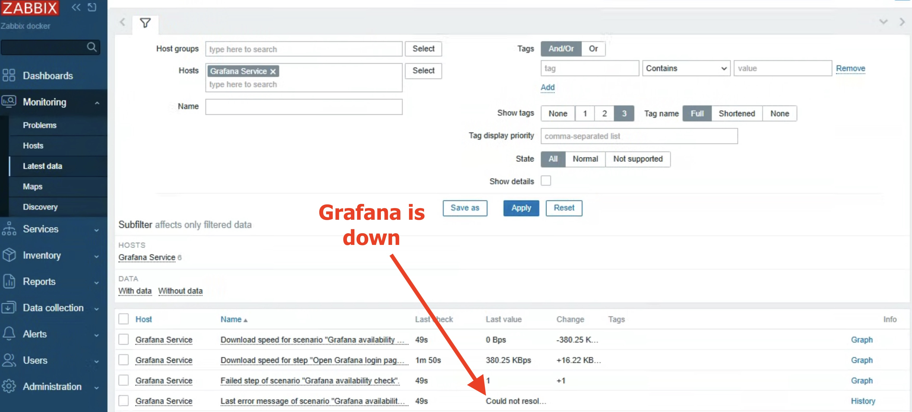
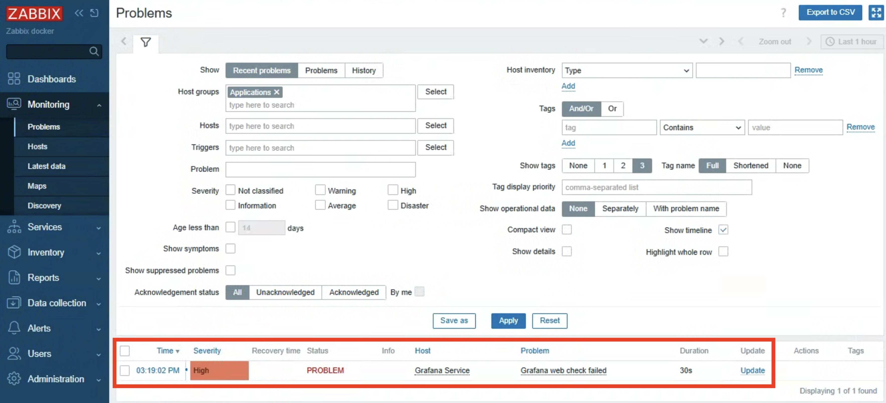
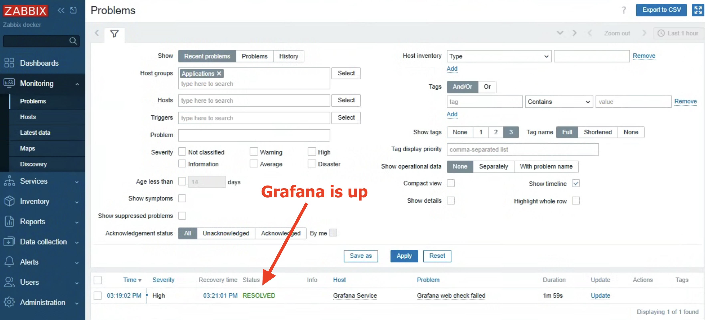
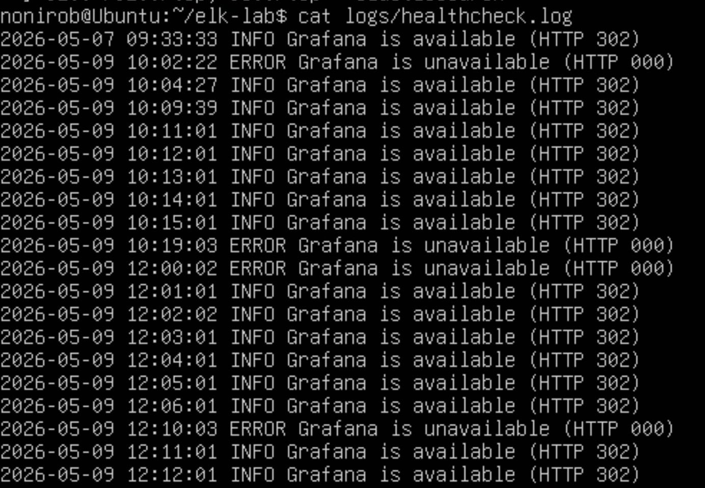

# Infra Support Lab

A local infrastructure support lab built with Docker Compose.

The goal of this project is to practice core tasks relevant to Technical Support Engineer / Support Analyst roles: log analysis, service monitoring, database checks, basic incident investigation, and simple Bash/cron automation.

---

# Stack

- Elasticsearch
- Kibana
- Filebeat
- PostgreSQL
- Grafana
- Prometheus
- Node Exporter
- Zabbix
- Bash
- cron
- Docker Compose

---

# Architecture

```text
Docker services
   |
   |-- PostgreSQL / Grafana / Zabbix / test logs
   |
Filebeat
   |
Elasticsearch
   |
Kibana

Node Exporter
   |
Prometheus
   |
Grafana

Zabbix
   |
Web checks / triggers / problems
```

---

# Main Services

| Service | Purpose | URL                   |
|---|---|-----------------------|
| Elasticsearch | Log storage and indexing | http://localhost:9200 |
| Kibana | Log search and analysis | http://localhost:5601 |
| Grafana | Metrics dashboard | http://localhost:3000 |
| Prometheus | Metrics collection | http://localhost:9090 |
| Node Exporter | Linux host metrics | http://localhost:9100 |
| Zabbix | Monitoring and alerting | http://localhost:8080 |
| PostgreSQL | Test database service | http://localhost:5432 |

---

# How to Run

Start the full lab environment:

```bash
sudo docker compose up -d
```

Check running containers:

```bash
sudo docker ps
```

---

# Log Analysis with ELK

Filebeat collects two types of logs:

## 1. Custom test logs

```text
./logs/*.log
```

## 2. Docker container logs

```text
/var/lib/docker/containers/*/*-json.log
```

This allows searching both manually generated incidents and real service logs in Kibana.

## Example search queries

```text
ERROR
```

```text
PostgreSQL unavailable
```

```text
Grafana is unavailable
```

---

# Monitoring with Grafana and Prometheus

Prometheus scrapes metrics from Node Exporter.

Grafana is used to visualize host metrics such as:

- CPU usage
- memory usage
- disk usage
- network traffic
- system load

The Node Exporter dashboard was imported into Grafana to practice real monitoring workflows.

---

# Monitoring with Zabbix

Zabbix was added to practice basic monitoring concepts:

- hosts
- web scenarios
- triggers
- problems
- service availability checks

A web scenario was created to check Grafana availability.

> Important note:
> Grafana may return HTTP `302` on `/` because it redirects to `/login`, so the web scenario should allow both `200` and `302`, or check `/login` directly.

---

# Bash + cron Healthcheck

A simple Bash script checks Grafana availability every minute via cron.

## Script

```text
scripts/check_grafana.sh
```

## Cron configuration

```cron
* * * * * /bin/bash /home/nonirob/elk-lab/scripts/check_grafana.sh >> /home/nonirob/elk-lab/logs/cron_debug.log 2>&1
```

The script writes INFO or ERROR messages into:

```text
logs/healthcheck.log
```

Filebeat collects this log and sends it to Elasticsearch.

---

# Example Troubleshooting Scenarios

## Scenario 1: Grafana unavailable

### Stop Grafana

```bash
docker stop grafana
```

### Investigation flow

1. Check Zabbix Problems
2. Check healthcheck logs
3. Search in Kibana:

```text
Grafana is unavailable
```

### Restore service

```bash
docker start grafana
```

---

## Scenario 2: PostgreSQL unavailable

### Stop PostgreSQL

```bash
docker stop postgres
```

### Investigation flow

Check Docker status:

```bash
docker ps -a
```

Check PostgreSQL logs:

```bash
docker logs postgres
```

Search related logs in Kibana.

### Restore service

```bash
docker start postgres
```

---

## Scenario 3: Grafana monitoring and recovery in Zabbix

### Stop Grafana

```bash
docker stop grafana
```

### Investigation flow

1. Open Zabbix:

```text
Monitoring → Latest data
```

2. Check the web scenario item:

```text
Grafana availability check
```

3. Observe failed check status and error message similar to:

```text
Could not resolve host
```

or connection-related errors.

4. Open:

```text
Monitoring → Problems
```

5. Verify that:

```text
Grafana Service
```

appears with status:

```text
PROBLEM
```

### Restore service

```bash
docker start grafana
```

### Verification after recovery

1. Wait about one minute for the next check interval.

2. Open:

```text
Monitoring → Latest data
```

3. Verify that the web scenario becomes healthy again.

4. Open:

```text
Monitoring → Problems
```

5. Confirm that the previous issue changes to:

```text
Resolved
```

This scenario was used to practice:
- service availability monitoring
- Zabbix web scenarios
- trigger-based problem detection
- incident recovery verification
- basic troubleshooting workflow

# Screenshots

## Docker containers



---

## Kibana error search



---

## Grafana dashboard



---

## Prometheus targets



---

## Zabbix latest data check



---

## Zabbix grafana problem occurred



---

## Zabbix grafana problem resolved



---

## Cron healthcheck logs



---

# What I Learned

During this lab I practiced:

- Linux-based troubleshooting
- Docker Compose service management
- log collection with Filebeat
- log analysis in Kibana
- monitoring with Prometheus and Grafana
- basic Zabbix monitoring concepts
- Bash scripting and cron automation
- service failure simulation and recovery flow

---

# Notes

This is a local learning lab, not a production deployment.

Security is intentionally simplified for local practice purposes (for example Elasticsearch security is disabled).